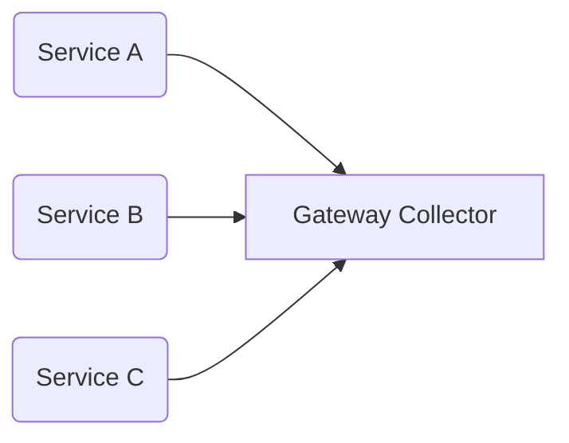
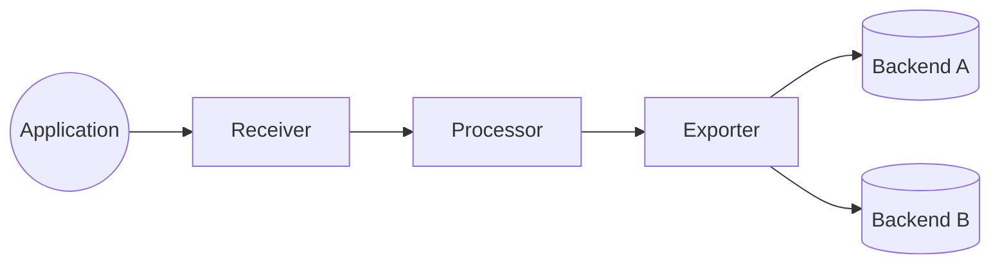

# Run the Project

This repository includes a **Docker Compose file** that spins up:

* OpenTelemetry Collector
* Supporting backends (jaeger, aspire and honeycomb)
* Applications emitting telemetry

### **1. Clone the Repository**

```bash
git clone https://github.com/your-repo.git
cd your-repo
```

### **2. Select the Branch**

#### For Agent Mode:

```bash
git checkout agent
```

#### For Gateway Mode:

```bash
git checkout gateway
```

### **3. Start the Environment**

```bash
docker-compose up -d
```

This command will:

* Start the OTel Collector
* Start all dependent services
* Expose dashboards / UIs

### **4. Verify Services Are Running**

Check all containers:

```bash
docker ps
```

### **5. Access Dashboards (Example URLs)**

* jaeger → [http://localhost:16686](http://localhost:16686)
* aspire → [http://localhost:18888](http://localhost:18888)
* product-management → [http://localhost:5001](http://localhost:5001)
* order-management→ [http://localhost:5002](http://localhost:5002)
* honeycomb→ [https://ui.honeycomb.io] (u need to sign in and get api key)

### **6. Stop Everything**

```bash
docker-compose down
```
---


# 🗂️ GitHub Branch Structure

This repository contains **two branches**, each representing a different deployment mode for the OpenTelemetry Collector:

### **1️⃣ `agent` Branch**

Used when the Collector runs as a **sidecar / agent** close to each service.

* Each microservice has its own Collector instance
* Useful for Kubernetes sidecar mode
* Lower network latency
* More isolated

### **2️⃣ `gateway` Branch**

Used when the Collector runs as a **centralized gateway / aggregator**.

* All services send telemetry to one shared Collector
* Easier to manage
* Suitable for production or centralized pipelines



---

# 🔍 **What is Observability?**

Observability is the ability to understand **what is happening inside a system**—such as an application, microservice, or infrastructure—by analyzing the telemetry it produces.

### Telemetry includes:

* **Logs** – Text-based event records
* **Metrics** – Numerical measurements
* **Traces** – Request flows across services

Observability helps determine *why* something is wrong, not just *what* is wrong.

---

# 🎯 **Why Do We Need Observability?**

* Detect and diagnose problems faster
* Improve system reliability & performance
* Help developers and operators understand system behavior
* Enable data-driven decision making

---

# 📡 **OpenTelemetry Overview**

**OpenTelemetry (OTel)** is an open-source observability framework providing a vendor-neutral standard for collecting:

* Traces
* Metrics
* Logs

### Benefits:

* Avoid vendor lock-in
* Unified telemetry standard
* Multi-language support

---

# 📊 **Traces, Metrics, and Logs**

### **Traces**

Show the path of a request across services.

### **Metrics**

Numerical values like:

* Request count
* Response time
* CPU usage
* Memory consumption

### **Logs**

Recorded events such as errors, warnings, or information messages.

---

# 🏗️ **OpenTelemetry Collector**

The **OpenTelemetry Collector** receives traces, metrics, and logs, processes the telemetry, and exports it to various observability backends.

It provides a vendor-agnostic, scalable pipeline for telemetry ingestion.

---

# 🔧 **Why Use the Collector?**

* Centralized data processing
* Decouples app code from observability providers
* Supports many protocols & formats
* Filtering and processing capabilities
* Improves performance and reliability
* Export to multiple destinations

---

# 🧩 **Collector Architecture Diagram**



---

# ⚙️ **Collector Components**

### **1. Receivers**

Collect telemetry from sources such as:

* OTLP
* Prometheus
* Jaeger
* Zipkin
* File logs

### **2. Processors**

Transform or modify telemetry:

* Filtering
* Batching
* Sampling
* Adding attributes

### **3. Exporters**

Send processed telemetry to backends like:

* Prometheus
* Grafana Tempo
* Elasticsearch
* Jaeger
* Loki

### **4. Service (Pipeline)**

Defines the flow: **Receivers → Processors → Exporters**

### **5. Extensions**

Add optional functionality:

* Health check
* Authentication
* Observability

---

# 🧭 **Collector Pipeline Diagram**

---

# 🏆 **Best Practices**

* Use **OTLP** format where possible
* Keep pipelines simple and modular
* Use batching + retry processors for reliability
* Configure resource attributes consistently
* Ensure secure authentication between apps and collector
* Always monitor the collector itself (metrics/logging)

---


